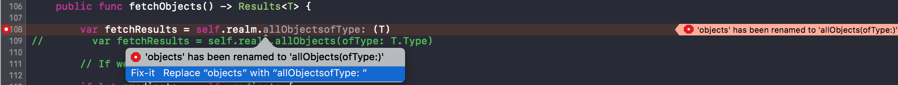
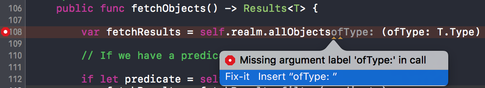

# Realm SwiftFetchedResultsController conversion to Swift 3 - issues

Attempting to convert the `SwiftFetchedResultsController` pod (part of [`RBQFetchedResultsController`](https://github.com/Roobiq/RBQFetchedResultsController)) to Swift 3 and ran into what seems to be a bug in either Xcode, the swift compiler or both.

## Project Setup

This repo has [`realm-cocoa`](https://github.com/realm/realm-cocoa) added as a submodule. Run the following command before attempting to build the project in Xcode.

```
git submodule update --init
```

## Before

```swift
    public func fetchObjects() -> Results<T> {

        var fetchResults = self.realm.objects(T)
                                      ^
```


### Initial fix-it



## After manual conversion

```swift
    public func fetchObjects() -> Results<T> {

        var fetchResults = self.realm.allObjects(ofType: T.Type)
                                                 ^
```

### 2 errors


```
FetchRequest.swift:108:50: error: cannot create a single-element tuple with an element label
        var fetchResults = self.realm.allObjects(ofType: T.Type)
                                                 ^~~~~~~~

FetchRequest.swift:108:49: error: missing argument label 'ofType:' in call
        var fetchResults = self.realm.allObjects(ofType: T.Type)
                                                ^
                                                ofType:
```

### Fix-it

```swift
var fetchResults = self.realm.allObjectsofType: (ofType: T.Type)
```




## License

This repo is licensed under the MIT License. See the [LICENSE](LICENSE.md) file for rights and limitations.

